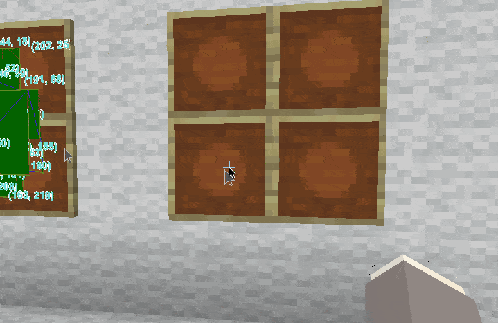

# EusMapDisplay
> Map-based Display Management Paper Plugin with Cursor Event Support


## Features

* MapDisplay with cursor events support
* Support large displays by putting parts of maps together


## Demos

### Cursor Events


### Application: Screen mirroring

Link: https://github.com/richardhyy/EusScreenMirroring


## Commands

| Command                                                 | Description                                                  | Permission         |
| ------------------------------------------------------- | ------------------------------------------------------------ | ------------------ |
| /mapdisplay list                                        | List existing MapDisplays                                    | `mapdisplay.admin` |
| /mapdisplay get \<UUID\> [Player] [Column(x)] [Line(y)] | Get a copy of MapDisplay (using `*` for `all columns/lines`) | `mapdisplay.admin` |
| /mapdisplay test                                        | Get MapDisplay for testing                                   | `mapdisplay.admin` |


## Development

### Add EusMapDisplay as Dependency
#### Maven
```xml
<repository>
    <id>jitpack.io</id>
    <url>https://jitpack.io</url>
</repository>
```
```xml
<dependency>
    <groupId>com.github.richardhyy</groupId>
    <artifactId>EusMapDisplay</artifactId>
    <version>1.0</version>
</dependency>
```

#### .. or Gradle
```
repositories {
    ...
    maven { url 'https://jitpack.io' }
}
```
```
dependencies {
    implementation 'com.github.richardhyy:EusMapDisplay:1.0'
}
```

### And to plugin.yml
```yaml
depend: [ EusMapDisplay ]
```
or `soft-depend`:
```yaml
soft-depend: [ EusMapDisplay ]
```


### Code Example

#### ExamplePlugin.java

```java
// ... imports ...

public final class ExamplePlugin extends JavaPlugin {

    private EusMapDisplay mapDisplayPlugin;

    @Override
    public void onEnable() {
        instance = this;

        try {
            this.mapDisplayPlugin = (EusMapDisplay) getServer().getPluginManager().getPlugin("EusMapDisplay");
        } catch (Exception ex) {
            getLogger().severe("Failed getting EusMapDisplay instance.");
            setEnabled(false);
            return;
        }

        PluginCommand pluginCommand = getServer().getPluginCommand("mapdisplaytest");
        assert pluginCommand != null;
        pluginCommand.setExecutor(new UserCommand(this));
    }

    public EusMapDisplay getMapDisplayPlugin() {
        return mapDisplayPlugin;
    }
}
```

#### UserCommand.java
```java
// ... imports ...

public class UserCommand implements CommandExecutor {
    ExamplePlugin plugin;
    
    public UserCommand(ExamplePlugin plugin) {
        this.plugin = plugin;
    }

    @Override
    public boolean onCommand(CommandSender sender, Command command, String label, String[] args) {
        if (sender instanceof Player player) {
            // STEP 1: Create new MapDisplay
            MapDisplay mapDisplay = plugin.getMapManager().createMap(2, 2, player.getWorld());
            
            // STEP 2: Get FILLED_MAP items
            for (ItemStack item : plugin.getMapManager().getMapItem(mapDisplay)) {
                player.getInventory().addItem(item);
            }
            
            // OPTIONAL STEP: Register Cursor Event Handlers
            mapDisplay.registerEventHandler(new DisplayEventHandler() {
                int x0 = -1;
                int y0 = -1;

                @Override
                public void onCursorPositionChanged(MapDisplay mapDisplay, Player player, int x, int y) {

                }

                @Override
                public void onLeftClick(MapDisplay mapDisplay, Player player, int x, int y) {
                    mapDisplay.getDisplay().drawText(x, y, String.format("(%d, %d)", x, y), new Font("Arial", Font.BOLD, 14), Color.CYAN);
                }

                @Override
                public void onRightClick(MapDisplay mapDisplay, Player player, int x, int y) {
                    if (x0 > -1 && y0 > -1) {
                        mapDisplay.getDisplay().drawRectangle(x0, y0, x, y, MapPalette.DARK_GREEN, MapPalette.LIGHT_GREEN);
                        mapDisplay.getDisplay().drawLine(x0, y0, x, y, MapPalette.BLUE);
                    }
                    x0 = x;
                    y0 = y;
                }

                @Override
                public void onWheelScroll(MapDisplay mapDisplay, Player player, int wheelAmt) {

                }
            });
        } else {
            sendPlayerOnly(sender);
        }
    }

    private void sendPlayerOnly(CommandSender receiver) {
        sendMessage(receiver, "&ePlayer only command.");
    }

    private void sendMessage(CommandSender receiver, String message) {
        receiver.sendMessage(message.replaceAll("&", "§"));
    }
}
```


#### Example In Practice (Including MapDisplay Persistence)

Link: [EusScreenMirroring Sourcecode](https://github.com/richardhyy/EusScreenMirroring)

